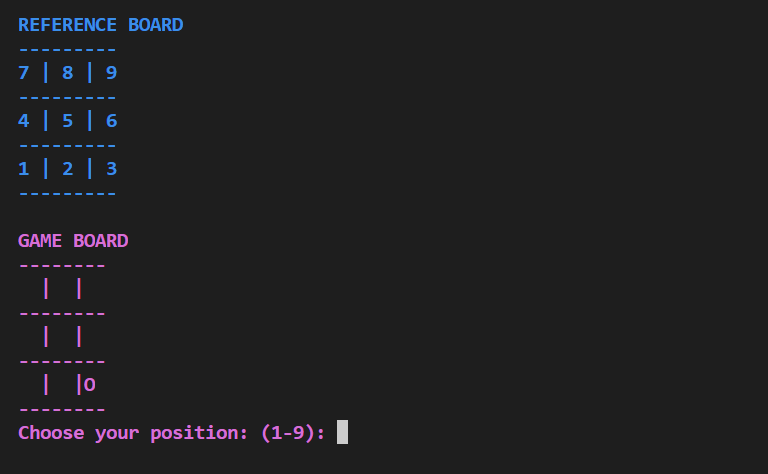

# Tic Tac Toe -v- Computer (by Luke Hickson)

Tic-tac-toe (American English), noughts and crosses (Commonwealth English), or Xs and Os (Irish English) is a paper-and-pencil game for two players who take turns marking the spaces in a three-by-three grid with X or O. The player who succeeds in placing three of their marks in a horizontal, vertical, or diagonal row is the winner. It is a solved game, with a forced draw assuming best play from both players.  [Live Website Here]().

## Table of Contents

1. [Rules of the Game ](#Rules)
2. [User Goals](#User-goals)
3. [User Expectations](#User-expectations)
4. [Features](#features)
   1. [Existing Features](#Existing-Features)
   2. [Future Features](#Future-Features)
5. [How the game is Played](#How-the-game-is-Played)
6. [Testing](#Testing)
   1. [Manual Testing](#Manual-Testing) 
   2. [Validator Testing](#Validator-Testing) 
   3. [Solved Bugs](#Solved-Bugs)
7. [Deployment](#Deployment)
8. [Credits](#Credits)
    1. [Technologies Used](#Technologies-Used) 
    2. [Content](#Content) 
    3. [Media](#Media)

 

# Rules of the Game (Historically)
 

[Go to the top](#Table-of-Contents)

 

# User Goals

 

[Go to the top](#Table-of-Contents)

 

 

# User Expectations

 

[Go to the top](#Table-of-Contents)

 

 

# Features

 

[Go to the top](#Table-of-Contents)

 

## Existing Features
 

 

 

* **Game Rules**
 

 

 
 
 

## Future Features

 

 

# How the game is Played
 

[Go to the top](#Table-of-Contents)

 

# Testing

 

[Go to the top](#Table-of-Contents)

 

## Manual Testing

 

## Game Testing
 

 

 

## Validator Testing
 

 
## Solved Bugs
 

 

# Deployment

 

[Go to the top](#Table-of-Contents)

 

## GitHub Pages
 

 

# Credits

 

[Go to the top](#Table-of-Contents)

 

## Technologies Used
 

 

## Content 
 

 

## Media

 

