# Tic Tac Toe -v- Computer (by Luke Hickson)

Tic-tac-toe (American English), noughts and crosses (Commonwealth English), or Xs and Os (Irish English) is a paper-and-pencil game for two players who take turns marking the spaces in a three-by-three grid with X or O. The player who succeeds in placing three of their marks in a horizontal, vertical, or diagonal row is the winner. It is a solved game, with a forced draw assuming best play from both players.  [Live Website Here]().
 

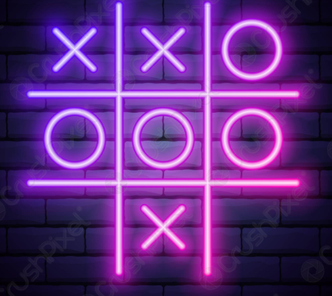
 

## Table of Contents

1. [Rules of the Game ](#Rules)
2. [User Goals](#User-goals)
3. [User Expectations](#User-expectations)
4. [Features](#features)
   1. [Future Features](#Future-Features)
5. [How the game is Played](#How-the-game-is-Played)
6. [Testing](#Testing)
   1. [Manual Testing](#Manual-Testing) 
   2. [Validator Testing](#Validator-Testing) 
   3. [Solved Bugs](#Solved-Bugs)
7. [Deployment](#Deployment)
8. [Credits](#Credits)
    1. [Technologies Used](#Technologies-Used) 
    2. [Content](#Content) 
    3. [Media](#Media)

 

# Rules of the Game (Historically)
 

Tic-tac-toe is played on a three-by-three grid by two players, who alternately place the marks X and O in one of the nine spaces in the grid.
There is no universally-agreed rule as to who plays first.
The Aim of the game is the get three of your marks in a horizontal, vertical, or diagonal row.
Players soon discover that the best play from both parties leads to a draw. Hence, tic-tac-toe is often played by young children who may not have discovered the optimal strategy.
 

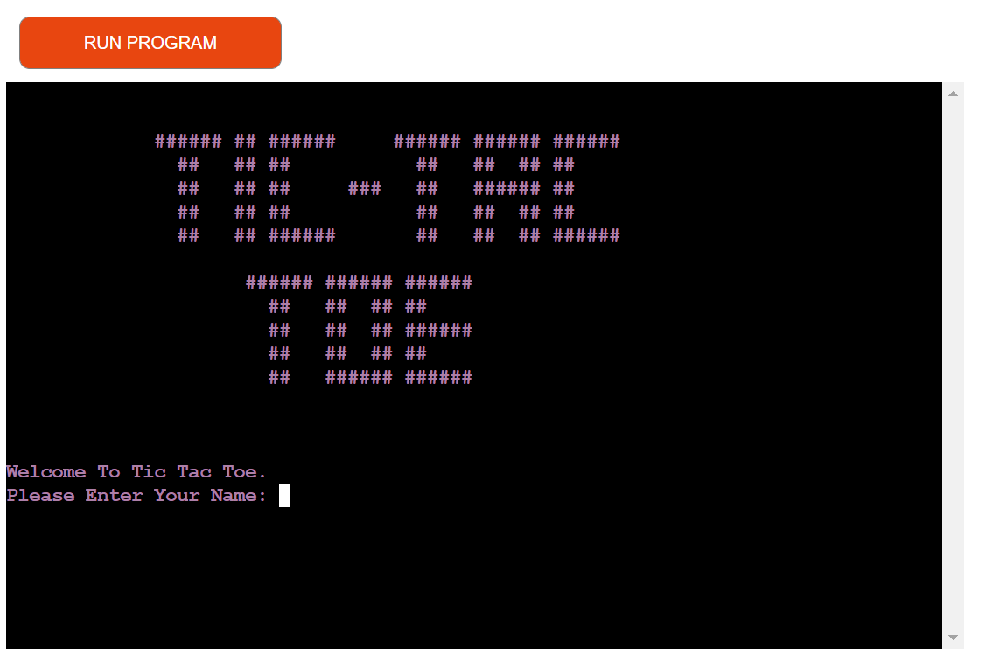
 

[Go to the top](#Table-of-Contents)

 

# User Goals
 

## Game Flow

 

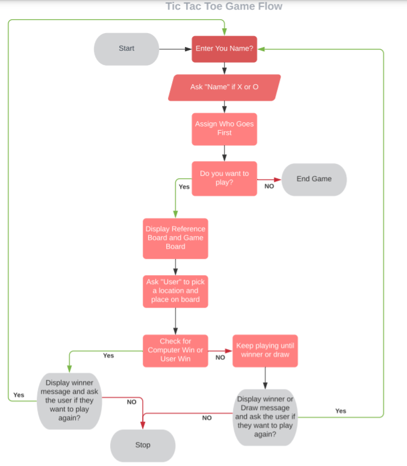

 

## I want to create a game that is easy to navigate for users.

* Was this achieved?

Yes

* How was this achieved?

This was achieved by taking a very simple apporach to the classic Tic Tac Toe.\
The game will run in a smooth loop to allow the user to keep playing as many times as they want to or can end the game.

## I want the user to play against a computer rather than a 2 player game.

* Was this achieved?

Yes

* How was this achieved?

This was achieved by creating a computer choice function which randomly generates a choice on the board for the computer.  

## I want to make it clear by using a color scheme (Win=Green , Lose=Red) the outcome of the game

* Was this achieved?

Yes

* How was this achieved?

This was achieved by adding color to the various outcomes of the game. 

## Game Colors

* Winner Message, Green ("\033[1;34m").\
* Lose Message, Red ("\033[1;31;31m").\
* Draw Message, White ("\033[1;37;40m").\

* Main Game Color,Pink ("\033[1;35;35m").\
* Reference Board color, Blue ("\033[1;34;34m").

  

[Go to the top](#Table-of-Contents)

 

# Features

 

## Welcome page

* This is the first page you see when the app loads. On this page there is a Tic Tac Toe image located at the top of the screen, a welcoem message and a question to the user. The question asks the user "Please Enter Your Name: ".

 

## Choose Marker

* The player is welcomed by name and asked to choose a marker to play with. "X" or "O".

 

## Ready to Play?

* After the user chooses a marker , either the user of computer will play first.
The user is asked one more time if they are ready to play?

 

## Main Game Screen

* The user is presented with the main game screen. A reference board in blue and a game board in pink.
* The user is asked to pick a position to drop their marker.
* If the computer was chose to go first , it's move will already be on the board.

 

## User Win Screen

* In the event of the user winning, the user is presented with a winner message in green , and asked if they want to play again

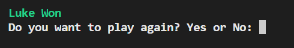

 

## Computer Win Screen

* In the event of the computer winning, the user is presented with a loosing message in red , and asked if they want to play again

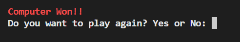

 

## Draw Screen

* In the event of a draw, the user is presented with a draw message in white , and asked if they want to play again

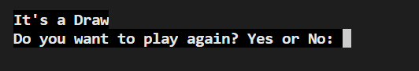

 

## Thanks for Playing Screen

* The user has selectted that they do not want to play again and is displayed the message below.

 

[Go to the top](#Table-of-Contents)

 

# Future Features

## Minimax Algorithim

* In the future i woudl like to implennt the Minimax algorithm for the computer choice.
This would add a much higher level of difficulty to the game.
Currently it is only a randomly generated computer choice.

# Testing

 

## Python

* Python was tested using PEP8 validator

* The Python results came back with the following:

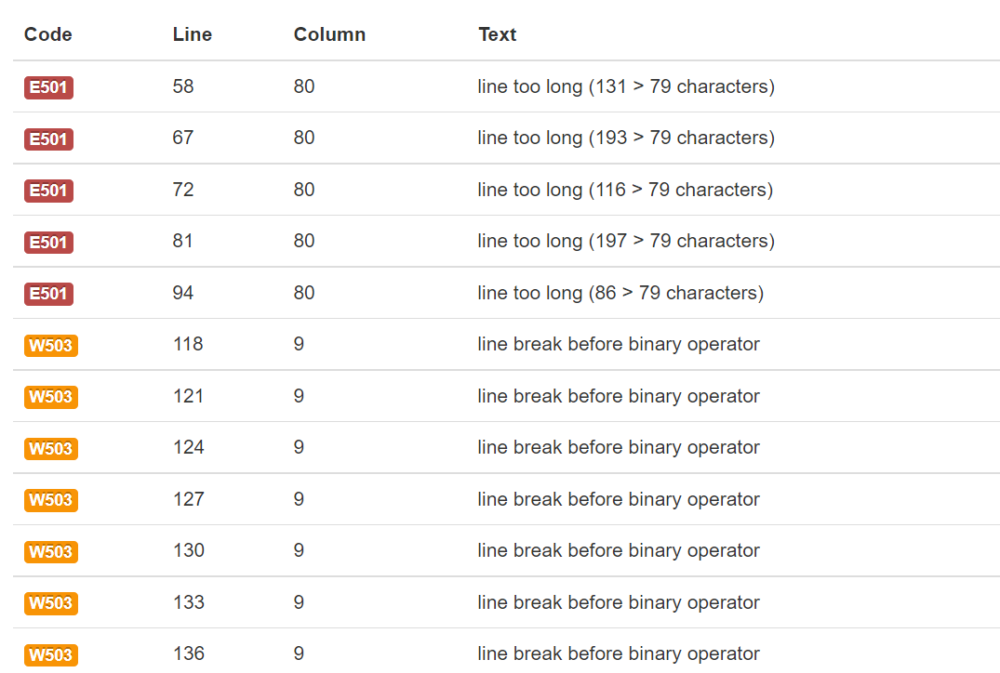

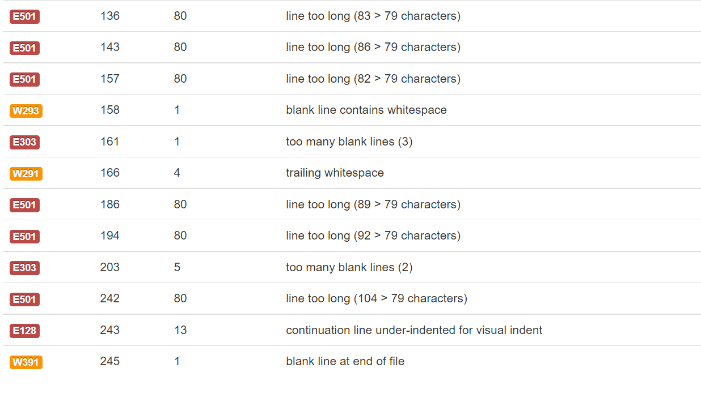

## E501(Line Too Long)

 
Resolved
 

## W503(Line Break Before Binary Operator)

 
Resolved
 

## E303(Too Many Blank Lines)

 
Resolved
 

## W293(Blank Line Contains Whitespace)

 
Resolved
 

## W291(Trailing Whitespace)

 
Resolved
 

## E128(Continuation Line Under-Indented For Visual Indent)

 
Resolved
 

## W391(Blank Line At End Of File)

 
Resolved
 

# PEP8 All Correct

 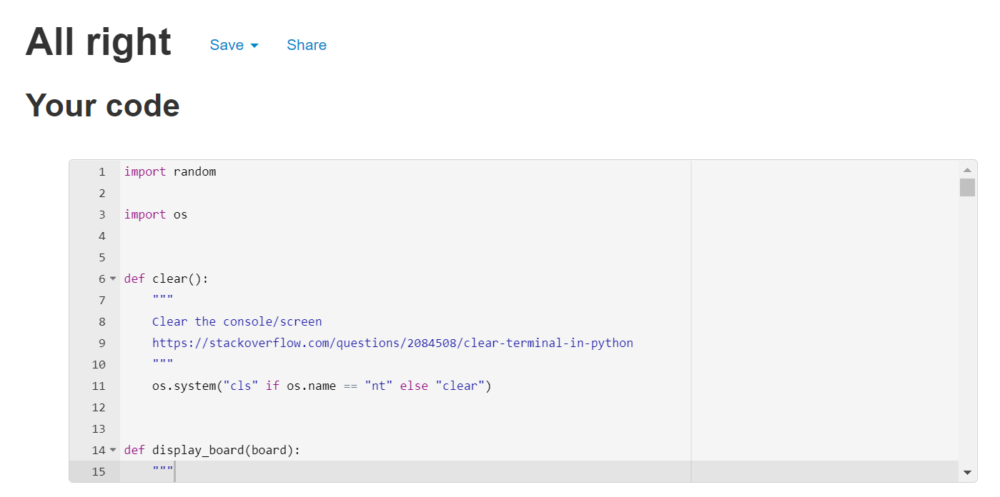

[Go to the top](#Table-of-Contents)

 

## Manual Testing

* When the gaem is first run , the user can eneter in any name , which may include letters , numbers and special characters.
This was tested and works as expected. (The Letter F was tested as a name)

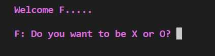

 

* The user is then asked if you want to choose "X" or "O".
* If neither "X" or "O" is entered , the program will keep asking the name quesitons until a valid input is recieved.

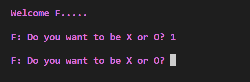

 

* The user is then asked if they are ready to play (Yes or No).\
* A bug was found here when the user enters no.\
* This was resolved by amending the play_game variable code.

*  This is the error that was recieved
 
 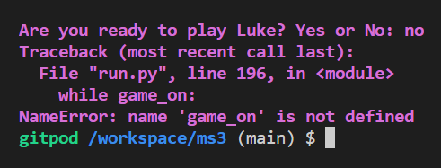
 
  
 

## Code Amendment

   play_game = input('Are you ready to play? Enter Yes or No. ')
    
      if play_game.lower()[0] == 'y':
         game_on = True
      else:
        game_on = False
        

 
  
 
 After this amendment , the code worked as expected.
 
* Once the user selects "No" , They are then asked if they wish to "play again".\
* If not , the user is displayed a thank you message , and instrucitons how to paly again.

 
 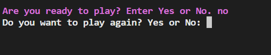
 
 
 
 

 
 

 

## Game Testing
 

 

 

## Validator Testing
 

 
## Solved Bugs
 

 

# Deployment

 

[Go to the top](#Table-of-Contents)

 

## GitHub Pages
 

 

# Credits

 

[Go to the top](#Table-of-Contents)

 

## Technologies Used
 

 

## Content 
 

 

## Media

 

